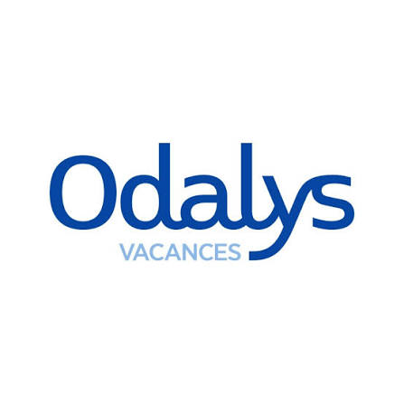
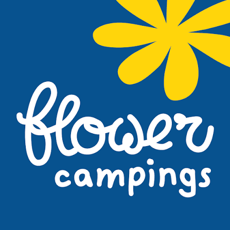

# 👋 Hi, I'm Pierre!

---

### What I Do
Amongst others find projects related to:
<ul>
  <li><a href="https://github.com/Pierre-mulliez1/Repsol_prediction"> Machine Learning</a></li>
  <li><a href="https://github.com/Pierre-mulliez1/streamlit_audit"> GenAI</a></li>
  <li><a href="https://github.com/Pierre-mulliez1/Spark_spotify_playlists"> Data Manipulation & Analytics</a></li>
  <li><a href="https://github.com/Pierre-mulliez1/Capwater2022"> Data engineering </a></li>
  <li><a href="https://github.com/Pierre-mulliez1/cabinetdentairepontdelarc.github.io"> Web Development </a></li>
</ul>
Feel free to dive into my repositories to see what I'm working on!

---

### Connect with me:
<ul>
  <li><a href="https://www.linkedin.com/in/pierre-mulliez/" target="_blank"> LinkedIn</a></li>
</ul>

---

### Current Role
<h4>Lead data Platform @ <a href="https://www.devoteam.com/" target="_blank">Magora ( ex Odalys ) </a></h4>

